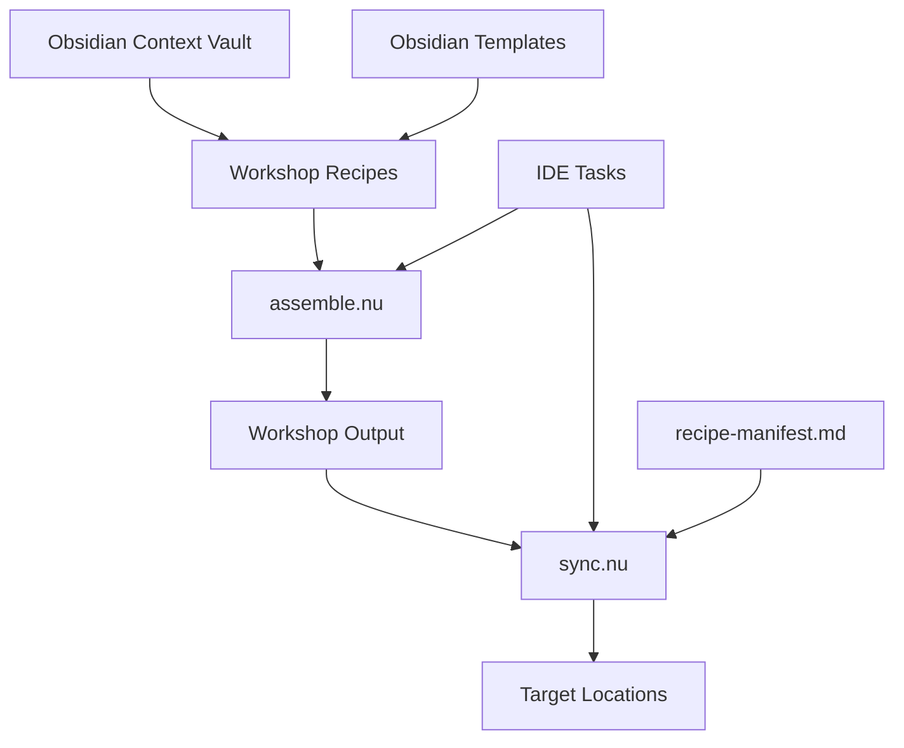

# Design Document

## Overview

A minimal context management system using two Nushell scripts for assembling and syncing context documentation. The system uses YAML recipes embedded in markdown to specify slice extraction and target deployment, following the bespoke principle of disposable software optimized for operator workflow.

## Architecture



**File locations:**
- **Scripts**: `C:/Users/synta.ZK-ZRRH/.dev/.scripts/assemble.nu` and `sync.nu`
- **Context vault**: `.context/` (Obsidian vault with templates and frontmatter)
- **Recipes**: `.context/workshop/` (created from Obsidian templates)
- **Output**: `.context/workshop/output/`
- **Manifest**: `.context/workshop/recipe-manifest.md` (Obsidian document)

## Components and Interfaces

### Recipe Format

**Obsidian frontmatter + YAML block:**
```markdown
---
id: recipe-claude-agent
created: 2026-01-11
modified: 2026-01-11
status: active
type:
  - "agent"
---

```yaml
name: claude-agent
target_locations:
  - path: ~/.config/claude/system.md
sources:
  - slice: agent=claudi-claude-code
    file: .context/agents/assistant.md
  - slice: skill=context-fundamentals  
    file: .context/skills/context-fundamentals/SKILL.md
template: |
  # Claude System Prompt
  {content}
```

# Claude Agent Recipe
This recipe assembles the Claude coding agent.
```

**Template structure** (from your existing templates):
- `recipe-agent-{{name}}.md`
- `recipe-kiro-{{name}}.md` 
- `recipe-power-{{name}}.md`
- `recipe-skill-{{name}}.md`

### Slice Extraction

**Existing slice markers:**
```markdown
<!-- slice:agent=claudi-claude-code -->
Content to extract
<!-- /slice -->
```

**Nushell slice extraction:**
```nu
def extract_slice [file: string, slice_id: string] {
  open $file 
  | lines 
  | where ($it | str contains $"<!-- slice:($slice_id) -->")
  | # Extract content between markers
}
```

### assemble.nu Script

**Location**: `C:/Users/synta.ZK-ZRRH/.dev/.scripts/assemble.nu`

**Core functionality (~50 lines):**
1. Find all recipe `.md` files in `.context/workshop/` (excluding templates/)
2. Parse Obsidian frontmatter and extract YAML code blocks
3. For each slice reference, extract content between slice markers
4. Apply simple string template substitution
5. Write assembled content to `.context/workshop/output/`
6. Update `.context/workshop/recipe-manifest.md` with run logs

**Key Nushell operations:**
- `ls .context/workshop/*.md | where name !~ templates` - Find recipes
- Parse frontmatter and extract YAML blocks from markdown
- `str replace` - Template substitution
- `save` - Write outputs
- Update manifest with Obsidian frontmatter

### sync.nu Script

**Location**: `C:/Users/synta.ZK-ZRRH/.dev/.scripts/sync.nu`

**Core functionality (~30 lines):**
1. Read existing recipe-manifest.md for deployment tracking
2. Copy all files from `.context/workshop/output/` to target locations
3. Track deployments in manifest
4. Remove files that were previously synced but no longer exist
5. Update recipe-manifest.md with sync results

**Key Nushell operations:**
- Parse manifest markdown for deployment records
- `cp` - Copy files to targets
- `rm` - Clean orphaned files
- Update manifest markdown with new deployment info

## Data Models

### Recipe Structure (Obsidian + YAML)
```markdown
---
id: recipe-name
created: 2026-01-11
modified: 2026-01-11
status: active | draft | archived
type:
  - "agent" | "kiro" | "power" | "skill"
---

```yaml
name: recipe-name
target_locations:
  - path: /target/location/file.md
sources:
  - slice: slice-identifier
    file: source/file/path.md
template: |
  Template with {content} substitution
```

# Recipe Description
Human-readable description of what this recipe does.
```

### Manifest Structure (Obsidian Markdown)
```markdown
---
id: recipe-manifest
created: 2026-01-11
modified: 2026-01-11
status: log
type:
  - "log"
---

## Active Recipes

- **recipe-claude-agent**: Last run 2026-01-11T10:30:00Z
  - Output: `claude-agent.md` → `~/.config/claude/system.md`
  - Status: ✓ synced

- **recipe-kiro-skills**: Last run 2026-01-11T10:30:00Z  
  - Output: `kiro-skills.md` → `~/.kiro/skills/bundle.md`
  - Status: ✓ synced

## Deployment Log

### 2026-01-11T10:30:00Z
- Assembled 3 recipes
- Synced 3 outputs
- Cleaned 1 orphaned file
```

## Correctness Properties

*Simple validation for a simple system - no enterprise theater.*

**Property 1: Recipe Processing Completeness**
*For any* valid recipe file in `.context/workshop/`, assemble.nu should process it and generate output
**Validates: Requirements 3.1**

**Property 2: Slice Extraction Accuracy**  
*For any* valid slice reference, the extracted content should match exactly what's between the slice markers
**Validates: Requirements 2.1**

**Property 3: Template Substitution**
*For any* recipe template with `{content}` placeholder, the output should have content substituted correctly
**Validates: Requirements 2.2**

**Property 4: Sync Completeness**
*For any* file in output folder, sync.nu should copy it to all specified target locations
**Validates: Requirements 3.2**

**Property 5: Orphan Cleanup**
*For any* file that was previously synced but no longer exists in output, sync.nu should remove it from targets
**Validates: Requirements 3.3**

## Error Handling

Simple error handling for disposable software:

- **File not found**: Skip and continue with clear message
- **Invalid YAML**: Report parsing error with line number
- **Missing slice**: Report missing slice reference
- **Permission errors**: Report and continue with other files
- **Target path creation**: Create directories as needed

## Testing Strategy

Minimal testing approach:

### Manual Testing
- Test with real recipes and slices
- Verify outputs match expectations
- Test sync cleanup behavior

### Simple Validation
- YAML parsing works
- Slice extraction works  
- File copying works
- Manifest tracking works

No complex property-based testing framework - just verify the basic operations work correctly.