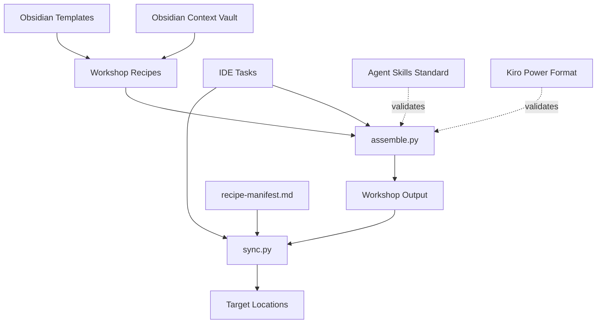

# Design Document

## Overview

A minimal context management system using two Nushell scripts for assembling and syncing context documentation. The system uses YAML recipes embedded in markdown to specify slice extraction and target deployment, following the bespoke principle of disposable software optimized for operator workflow.

## Architecture



**File locations:**
- **Scripts**: `C:/Users/synta.ZK-ZRRH/.dev/.scripts/assemble.py` and `sync.py`
- **Context vault**: `.context/` (Obsidian vault with templates and frontmatter)
- **Recipes**: `.context/workshop/` (created from Obsidian templates)
- **Output**: `.context/workshop/output/`
- **Manifest**: `.context/workshop/recipe-manifest.md` (Obsidian document)

**Output Formats:**

**Agent Skills Standard** (agentskills.io):
```
skill-name/
├── SKILL.md          # Required: YAML frontmatter + markdown body
├── scripts/          # Optional: executable code (Python, Bash, JS)
│   ├── script1.py
│   └── script2.sh
├── references/       # Optional: additional docs (loaded on demand)
│   ├── guide-1.md
│   └── api-ref.md
└── assets/           # Optional: static resources
    └── data.json
```

**Kiro Power Format**:
```
power-name/
├── POWER.md          # Required: main documentation
├── mcp.json          # Optional: only if MCP tools included
└── steering/         # Required: all guides/docs as .md
    ├── getting-started.md
    ├── advanced-usage.md
    └── ...
```

## Components and Interfaces

### Recipe Format

**Obsidian frontmatter + YAML block:**

**Simple Agent Recipe (no template):**
```markdown
---
id: recipe-agent-claudi
created: 2026-01-15
modified: 2026-01-15
status: draft
type:
  - agent
---

```yaml
name: Claudi
target_locations:
  - path: ~/.claude/CLAUDE.md
sources:
  - slice: agent=claudi-claude-code
    slice-file: agents/agent-roles.md
  - file: agents/steering-global-operator.md
  - file: agents/steering-global-principles.md
```
```

**Complex Skill Recipe (with template and type-specific fields):**
```markdown
---
id: recipe-skill-bundle
created: 2026-01-15
modified: 2026-01-15
status: active
type:
  - skill
---

```yaml
name: core-skills-bundle
target_locations:
  - path: ~/.kiro/skills/core-bundle.md
sources:
  - slice: skill=agent-steering
    slice-file: skills/agent-steering/SKILL.md
  - slice: skill=context-management
    slice-file: skills/context-management/SKILL.md
template: |
  # Core Skills Bundle
  
  ## Skills Included
  {content}
  
  ## Usage
  Load this bundle for core agent capabilities.
skill_type: bundle
bundle_options:
  create_catalog: true
  include_metadata: true
```
```

**Multi-Section Recipe (multiple outputs):**
```markdown
---
id: recipe-agent-kiro
created: 2026-01-15
modified: 2026-01-15
status: draft
type:
  - agent
---

```yaml
name: Kiro
target_locations:
  - path: ~/.kiro/steering/agent.md
sources:
  - slice: agent=kiro
    slice-file: agents/agent-roles.md

---
   
target_locations:
  - path: ~/.kiro/steering/operator.md
sources:
  - file: agents/steering-global-operator.md

---

target_locations:
  - path: ~/.kiro/steering/principles.md
sources:
  - file: agents/steering-global-principles.md
```
```

**Source Types:**
- `slice` + `slice-file`: Extract content between `<!-- slice:id -->` markers
- `file` only: Include entire file content

**Template structure** (from existing templates):
- `recipe-agent-{{name}}.md` - Simple agent recipes
- `recipe-skill-{{name}}.md` - Complex skill bundles with metadata
- `recipe-power-{{name}}.md` - Power packages with validation
- `recipe-kiro-{{name}}.md` - Kiro-specific configurations

### Slice Extraction

**Slice markers in source files:**
```markdown
<!-- slice:agent=claudi-claude-code -->
Content to extract
<!-- /slice -->
```

**Implicit slice ending:**
Slices can end with explicit `<!-- /slice -->` or implicitly at the next `<!-- slice:` marker.

**Python slice extraction:**
```python
def extract_slice(file_path: Path, slice_id: str) -> Optional[str]:
    """Extract content between slice markers."""
    content = file_path.read_text()
    start_pattern = f"<!-- slice:{slice_id} -->"
    start_idx = content.find(start_pattern)
    
    if start_idx == -1:
        return None
    
    start_idx += len(start_pattern)
    
    # Find end: explicit marker or next slice
    end_idx = content.find("<!-- /slice -->", start_idx)
    next_slice_idx = content.find("<!-- slice:", start_idx)
    
    if end_idx == -1 and next_slice_idx == -1:
        return content[start_idx:].strip()
    elif end_idx == -1:
        return content[start_idx:next_slice_idx].strip()
    elif next_slice_idx == -1:
        return content[start_idx:end_idx].strip()
    else:
        return content[start_idx:min(end_idx, next_slice_idx)].strip()
```

**Whole file inclusion:**
```python
def include_file(file_path: Path) -> Optional[str]:
    """Include entire file content."""
    return file_path.read_text().strip()
```

### assemble.py Script

**Location**: `C:/Users/synta.ZK-ZRRH/.dev/.scripts/assemble.py`

**Core functionality:**
1. Find all recipe `.md` files in `.context/workshop/` (excluding `recipe-manifest.md` and `template*`)
2. Parse Obsidian frontmatter and extract YAML code blocks
3. Support multi-section recipes by splitting on `---` separators
4. For each source:
   - If `slice` + `slice-file`: Extract content between slice markers
   - If `file` only: Include entire file content
5. Concatenate sources with `\n\n` separator
6. Apply template substitution if template provided (default: `{content}`)
7. Write assembled content to `.context/workshop/output/`
8. Update `.context/workshop/recipe-manifest.md` with run logs

**Key operations:**
- `frontmatter.load()` - Parse Obsidian frontmatter
- `re.search(r'```yaml\n(.*?)\n```', content, re.DOTALL)` - Extract YAML blocks
- `content.split('\n---\n')` - Split multi-section recipes
- `yaml.safe_load()` - Parse YAML configuration
- `extract_slice()` or `include_file()` - Get source content
- `template.replace('{content}', assembled)` - Apply template
- Update manifest with timestamps and status

**Type-specific field handling:**
- Agent recipes: `agent_format`, `output_type`, `persona_elements` (future use)
- Skill recipes: `skill_type`, `bundle_options`, `output_formats`, `cross_references`
- Power recipes: `power_structure`, `metadata`, `dependencies`, `validation`

These fields are parsed but not yet processed - they're reserved for future enhancement.

### sync.py Script

**Location**: `C:/Users/synta.ZK-ZRRH/.dev/.scripts/sync.py`

**Core functionality:**
1. Read existing recipe-manifest.md for deployment tracking
2. Parse all recipes to get target_locations
3. Copy files from `.context/workshop/output/` to target locations
4. Track deployments in manifest
5. Remove files that were previously synced but no longer exist in output
6. Update recipe-manifest.md with sync results

**Key operations:**
- Parse manifest markdown for deployment records
- `shutil.copy2()` - Copy files to targets with metadata
- `Path.mkdir(parents=True, exist_ok=True)` - Create target directories
- `Path.unlink()` - Clean orphaned files
- Update manifest markdown with new deployment info and timestamps

## Data Models

### Recipe Structure (Obsidian + YAML)

**Minimal Agent Recipe:**
```yaml
name: agent-name
target_locations:
  - path: /target/location/file.md
sources:
  - slice: slice-identifier
    slice-file: source/file/path.md
  - file: another/file/path.md
```

**Full Recipe with Optional Fields:**
```yaml
name: recipe-name
target_locations:
  - path: /target/location/file.md
sources:
  - slice: slice-identifier
    slice-file: source/file/path.md
  - file: whole/file/path.md
template: |
  # Custom Header
  {content}
  # Custom Footer

# Type-specific fields (optional, for future use)
agent_format: claude | kiro | openai | custom
skill_type: individual | bundle
power_structure:
  power_md: true
  config_json: true
  mcp_servers: []
```

**Multi-Section Recipe:**
Multiple YAML blocks separated by `---` in one file, each producing a separate output.

### Manifest Structure (Obsidian Markdown)
```markdown
---
id: recipe-manifest
created: 2026-01-11
modified: 2026-01-11
status: log
type:
  - "log"
---

## Active Recipes

- **recipe-claude-agent**: Last run 2026-01-11T10:30:00Z
  - Output: `claude-agent.md` → `~/.config/claude/system.md`
  - Status: ✓ synced

- **recipe-kiro-skills**: Last run 2026-01-11T10:30:00Z  
  - Output: `kiro-skills.md` → `~/.kiro/skills/bundle.md`
  - Status: ✓ synced

## Deployment Log

### 2026-01-11T10:30:00Z
- Assembled 3 recipes
- Synced 3 outputs
- Cleaned 1 orphaned file
```

## Correctness Properties

*Simple validation for a simple system - no enterprise theater.*

**Property 1: Recipe Processing Completeness**
*For any* valid recipe file in `.context/workshop/`, assemble.nu should process it and generate output
**Validates: Requirements 3.1**

**Property 2: Source Processing Accuracy**  
*For any* source with `slice` + `slice-file`, the extracted content should match exactly what's between the slice markers; *for any* source with only `file`, the content should match the entire file
**Validates: Requirements 2.1, 2.2**

**Property 3: Template Substitution**
*For any* recipe template with `{content}` placeholder, the output should have content substituted correctly; *for any* recipe without template, output should be the assembled content directly
**Validates: Requirements 2.4, 2.5**

**Property 4: Sync Completeness**
*For any* file in output folder, sync.nu should copy it to all specified target locations
**Validates: Requirements 3.2**

**Property 5: Orphan Cleanup**
*For any* file that was previously synced but no longer exists in output, sync.py should remove it from targets
**Validates: Requirements 3.3**

**Property 6: Multi-Section Processing**
*For any* recipe with `---` separators, each section should produce a separate output file
**Validates: Requirements 12.2**

## Error Handling

Simple error handling for disposable software:

- **File not found**: Skip and continue with clear message
- **Invalid YAML**: Report parsing error with line number
- **Missing slice**: Report missing slice reference
- **Permission errors**: Report and continue with other files
- **Target path creation**: Create directories as needed

## Testing Strategy

Minimal testing approach:

### Manual Testing
- Test with real recipes and slices
- Verify outputs match expectations
- Test sync cleanup behavior

### Simple Validation
- YAML parsing works
- Slice extraction works  
- File copying works
- Manifest tracking works

No complex property-based testing framework - just verify the basic operations work correctly.