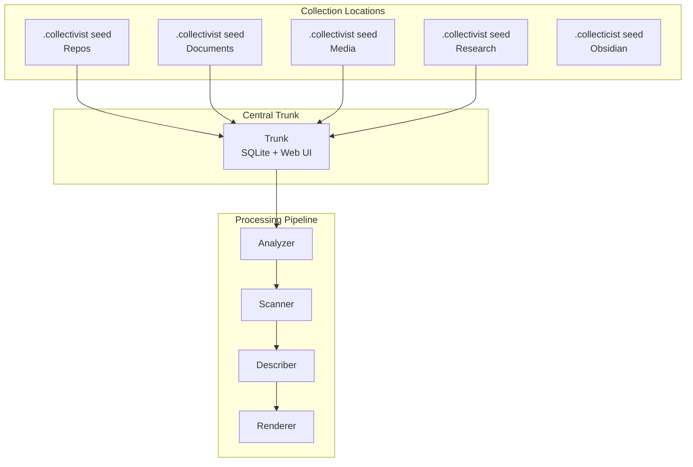
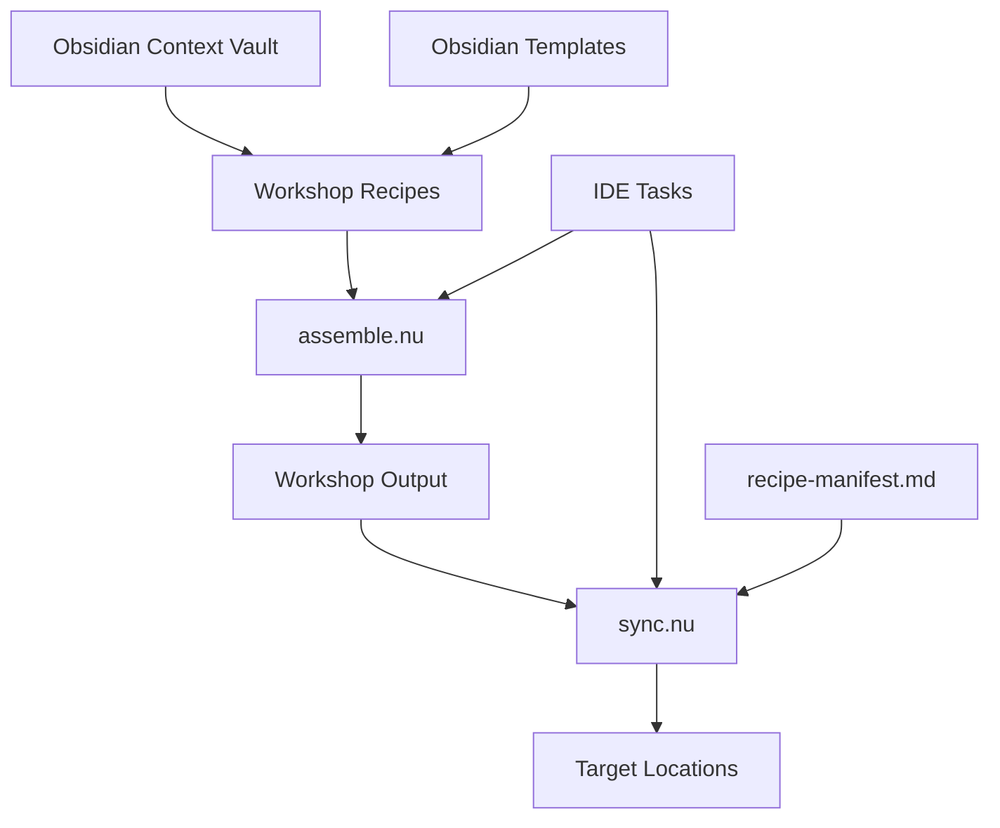

# 📋 Kiro Specs Documentation

*Complete 3-phase specification examples demonstrating structured development processes.*

## Table of Contents

- [Collectivist](https://github.com/SyntaxAsSpiral/Collectivist)
- [Context Workshop](#context-workshop)
  - [Design](#design---zdocumentscontextkirospecs-context-managementdesignmd)
  - [Requirements](#requirements---zdocumentscontextkirospecs-context-managementrequirementsmd)
  - [Tasks](#tasks---zdocumentscontextkirospecs-context-managementtasksmd)

---

## Collectivist

**Project**: [Collectivist](https://github.com/SyntaxAsSpiral/Collectivist) - AI-powered collection curation system
**Location**: `C:\Users\synta.ZK-ZRRH\.dev\collectivist\.kiro\specs\collectivist`

### Spec

#### Design - `C:\Users\synta.ZK-ZRRH\.dev\collectivist\.kiro\specs\collectivist\design.md`

# Design Document

## Overview

[Collectivist](https://github.com/SyntaxAsSpiral/Collectivist) implements a distributed-to-centralized architecture for AI-powered collection curation. The system deploys portable `.collectivist` seeds across different collection locations that automatically centralize to a coordination trunk for unified processing and documentation generation.

## Architecture

The system follows a hub-and-spoke model:

- **Distributed Seeds**: `.collectivist` folders deployed at collection locations
- **Central Trunk**: Coordination point with SQLite storage and web interface
- **Processing Pipeline**: Four-stage flow (Analyzer → Scanner → Describer → Renderer)



## Components and Interfaces

### Collection Seeds
- **Location**: `.collectivist` folders at collection roots
- **Function**: Local processing and data generation
- **Output**: Collection-specific index files

### Trunk
- **Storage**: SQLite database for aggregated data
- **Interface**: FastAPI backend with React frontend web interface
- **Function**: Discovery, registration, and coordination

### Processing Pipeline

#### Analyzer
- **Input**: Collection directory structure
- **Output**: Collection type detection and structural analysis
- **Function**: Determines processing strategy

#### Scanner (Plugin Architecture)
- **Interface**: Standard plugin interface for domain-specific scanning
- **Plugins**: Repository, Document, Media, Research scanners
- **Fallback**: Generic file metadata extraction

#### Describer
- **Input**: Scanned metadata
- **Output**: AI-generated summaries and categorizations
- **LLM Integration**: Multiple provider support with fallback

#### Renderer
- **Input**: Analyzed and described data
- **Output**: README.md files and documentation
- **Templates**: Collection-type-specific formatting

## Data Models

### Collection Index Schema
```yaml
collection:
  type: [repository|document|media|research]
  location: string
  last_updated: timestamp
  items: []
```

### Item Metadata Schema
```yaml
item:
  path: string
  type: string
  metadata: {} # Domain-specific fields
  description: string # AI-generated
  categories: [] # AI-assigned
```

### Configuration Schema
```yaml
# Global config
llm:
  providers: []
  fallback_chain: []

processing:
  cache_enabled: boolean
  parallel_workers: integer

# Collection-specific config (.collection/config.yaml)
collection:
  type_override: string
  custom_templates: {}
  scanner_options: {}
```
## Correctness Properties

*A property is a characteristic or behavior that should hold true across all valid executions of a system-essentially, a formal statement about what the system should do. Properties serve as the bridge between human-readable specifications and machine-verifiable correctness guarantees.*

### Property 1: Collection Type Detection Consistency
*For any* collection directory with identifiable content patterns, the system should consistently detect the same collection type across multiple runs.
**Validates: Requirements 2.1, 2.5**

### Property 2: Scanner Plugin Routing
*For any* file type with a registered scanner plugin, the system should route that file to the correct scanner plugin.
**Validates: Requirements 3.2, 3.5**

### Property 3: Processing Pipeline Completeness
*For any* collection that successfully completes processing, all four pipeline stages (Analyzer → Scanner → Describer → Renderer) should execute in sequence.
**Validates: Requirements 4.1, 4.2, 4.3, 4.4**

### Property 4: Metadata Extraction Completeness
*For any* supported file type, the appropriate scanner should extract all required metadata fields for that type.
**Validates: Requirements 1.1, 1.2, 1.3, 1.4**

### Property 5: README Generation Consistency
*For any* collection type, the system should generate a README.md file using the appropriate template for that collection type.
**Validates: Requirements 6.1, 6.3**

### Property 6: Cache Behavior Correctness
*For any* unchanged file, subsequent processing runs should use cached results rather than re-processing.
**Validates: Requirements 9.1, 9.3**

### Property 7: Error Isolation
*For any* collection with some failing items, the system should continue processing remaining items and complete successfully.
**Validates: Requirements 10.1, 10.5**

### Property 8: Configuration Override Hierarchy
*For any* collection with both global and local configuration, local configuration should override global settings.
**Validates: Requirements 8.1, 8.2**

### Property 9: LLM Fallback Chain
*For any* LLM provider failure, the system should attempt the next provider in the fallback chain.
**Validates: Requirements 5.3, 5.4**

### Property 10: Collection Registry Maintenance
*For any* discovered `.collectivist` folder, the trunk should register it in the SQLite database with correct metadata.
**Validates: Requirements 12.1, 12.2**

### Property 11: Web Interface Functionality
*For any* valid collection data, the web interface should display collection summaries and allow configuration management.
**Validates: Requirements 7.1, 7.2, 7.3**

### Property 12: Trunk Data Persistence
*For any* processed collection, the trunk should maintain persistent SQLite storage with collection registry and metadata.
**Validates: Requirements 11.1, 11.3, 11.5**

## Error Handling

### Error Categories
- **Item-level errors**: Individual file processing failures
- **Service errors**: LLM provider unavailability
- **System errors**: File access permissions, disk space
- **Configuration errors**: Invalid YAML, missing required fields

### Error Recovery Strategies
- **Graceful degradation**: Continue processing without failed components
- **Retry with backoff**: For transient service failures
- **Partial progress preservation**: Save completed work before termination
- **Detailed logging**: Context-rich error messages for debugging

## Testing Strategy

### Dual Testing Approach
The system requires both unit tests and property-based tests for comprehensive coverage:

- **Unit tests**: Verify specific examples, edge cases, and error conditions
- **Property tests**: Verify universal properties across all inputs
- Together they provide comprehensive coverage (unit tests catch concrete bugs, property tests verify general correctness)

### Property-Based Testing Configuration
- Use appropriate property-based testing library for the implementation language
- Configure each test to run minimum 100 iterations
- Tag each test with format: **Feature: collectivist, Property {number}: {property_text}**
- Each correctness property must be implemented by a single property-based test

### Unit Testing Focus
- Specific examples demonstrating correct behavior
- Integration points between pipeline stages
- Edge cases and error conditions
- Configuration validation and error messages

#### Requirements - `C:\Users\synta.ZK-ZRRH\.dev\collectivist\.kiro\specs\collectivist\requirements.md`

# Requirements Document

## Introduction

[Collectivist](https://github.com/SyntaxAsSpiral/Collectivist) is an AI-powered collection curator that transforms semantically coherent collections into living documentation substrates. The system uses a distributed-to-centralized architecture where portable `.collectivist` seeds are deployed across different collection locations and automatically centralize to a coordination trunk for unified curation and documentation generation.

## Glossary

- **Collection**: A semantically coherent set of items (repositories, documents, media files, research papers, etc.)
- **Trunk**: Central coordination point that aggregates and processes data from distributed collection seeds
- **Seed**: A portable `.collectivist` folder deployed at a specific collection location
- **Scanner**: Domain-specific component that extracts metadata from collection items
- **Analyzer**: Component that processes raw collection data and determines structure
- **Describer**: AI-powered component that generates contextual summaries and categorizations
- **Renderer**: Component that transforms analyzed data into documentation using templates
- **Collection_Config**: Configuration file (`.collection/config.yaml`) that defines collection behavior
- **Centralization**: Process of aggregating data from distributed collection seeds to the trunk
- **Pipeline**: Multi-stage processing flow: Analyzer → Scanner → Describer → Renderer

## Requirements

### Requirement 1: Multi-Format Collection Support

**User Story:** As a curator, I want to organize different types of collections (repositories, documents, media, research papers), so that I can apply consistent curation across diverse content types.

#### Acceptance Criteria

1. WHEN a collection contains repositories, THE System SHALL extract git metadata, commit history, and README content
2. WHEN a collection contains documents, THE System SHALL extract file metadata, content summaries, and modification timestamps
3. WHEN a collection contains media files, THE System SHALL extract metadata, creation dates, and generate preview information
4. WHEN a collection contains research papers, THE System SHALL extract citations, abstracts, and publication metadata
5. WHERE multiple content types exist in one collection, THE System SHALL handle mixed-format scanning appropriately

### Requirement 2: Distributed Collection Architecture with Type Detection

**User Story:** As a curator, I want portable `.collectivist` seeds to automatically detect their collection type and produce custom indexes, so that each collection is processed with domain-appropriate logic.

#### Acceptance Criteria

1. WHEN a `.collectivist` folder is deployed, THE System SHALL automatically detect the collection type based on content analysis
2. WHEN collection type is detected, THE System SHALL produce a custom index format appropriate for that collection type
3. THE System SHALL support repository collections, document collections, media collections, and research paper collections
4. WHEN collection type cannot be determined, THE System SHALL default to generic file collection processing
5. THE System SHALL store collection type metadata for consistent processing across runs

### Requirement 3: Plugin Architecture for Domain-Specific Scanning

**User Story:** As a developer, I want to extend the system with domain-specific scanners, so that I can add support for new collection types without modifying core code.

#### Acceptance Criteria

1. THE System SHALL load scanner plugins from a defined plugin directory
2. WHEN a new file type is encountered, THE System SHALL route it to the appropriate scanner plugin
3. WHEN no specific scanner exists, THE System SHALL fall back to generic file metadata extraction
4. THE System SHALL allow scanner plugins to define their own metadata schemas
5. THE System SHALL provide a standard plugin interface for consistent integration

### Requirement 4: Multi-Stage Processing Pipeline

**User Story:** As a system architect, I want clear separation between analysis, scanning, description, and rendering stages, so that the system is maintainable and each stage can be optimized independently.

#### Acceptance Criteria

1. WHEN processing begins, THE Analyzer SHALL determine collection structure and item types
2. WHEN analysis is complete, THE Scanner SHALL extract metadata using appropriate domain-specific logic
3. WHEN scanning is complete, THE Describer SHALL generate AI-powered summaries and categorizations
4. WHEN description is complete, THE Renderer SHALL generate documentation using configured templates
5. THE System SHALL allow each stage to be run independently for debugging and incremental processing

### Requirement 5: AI-Powered Contextual Description

**User Story:** As a curator, I want AI-generated descriptions and categorizations for collection items, so that I can understand and organize large collections without manual review.

#### Acceptance Criteria

1. WHEN processing collection items, THE Describer SHALL generate one-sentence technical summaries
2. WHEN generating descriptions, THE Describer SHALL assign categories from a configurable taxonomy
3. WHEN multiple LLM providers are configured, THE System SHALL support fallback between providers
4. WHEN LLM services are unavailable, THE System SHALL continue processing with metadata-only descriptions
5. THE System SHALL preserve existing descriptions and only generate new ones for items with null descriptions

### Requirement 6: Template-Based Documentation Rendering with README Generation

**User Story:** As a documentation maintainer, I want each collection to generate its own README file with deterministic formatting, so that every collection has discoverable documentation at its root.

#### Acceptance Criteria

1. THE System SHALL generate a README.md file at the root of each collection directory
2. WHEN generating READMEs, THE System SHALL perform deeper content scanning to extract meaningful summaries
3. THE System SHALL use collection-type-specific README templates for appropriate formatting
4. WHEN README generation requires content analysis, THE System SHALL scan file contents beyond just metadata
5. THE System SHALL preserve manual edits in designated sections while regenerating automated content

### Requirement 7: Web Interface for Non-Terminal Users

**User Story:** As a non-technical user, I want a web interface to configure and monitor collection curation, so that I can use the system without command-line expertise.

#### Acceptance Criteria

1. THE Web_Interface SHALL provide collection discovery and status monitoring
2. WHEN collections are found, THE Web_Interface SHALL display processing status and generated summaries
3. THE Web_Interface SHALL allow configuration of LLM providers and processing options
4. WHEN processing is running, THE Web_Interface SHALL show real-time progress updates
5. THE Web_Interface SHALL provide manual trigger controls for re-processing collections

### Requirement 8: Configuration Management

**User Story:** As a system administrator, I want flexible configuration options at multiple levels, so that I can customize behavior for different collections and deployment scenarios.

#### Acceptance Criteria

1. THE System SHALL support global configuration for default behaviors and LLM settings
2. WHEN a `.collection/config.yaml` exists, THE System SHALL override global settings with collection-specific configuration
3. THE System SHALL validate configuration files and provide clear error messages for invalid settings
4. WHEN configuration changes, THE System SHALL apply new settings without requiring restart
5. THE System SHALL provide configuration templates and documentation for common use cases

### Requirement 9: Incremental Processing and Caching

**User Story:** As a performance-conscious user, I want the system to avoid re-processing unchanged items, so that large collections can be updated efficiently.

#### Acceptance Criteria

1. WHEN items haven't changed since last processing, THE System SHALL skip re-analysis and use cached results
2. WHEN new items are added, THE System SHALL process only the new items and merge with existing data
3. THE System SHALL detect file modifications using timestamps and checksums
4. WHEN forced refresh is requested, THE System SHALL re-process all items regardless of cache status
5. THE System SHALL store processing metadata to enable resumable operations after interruption

### Requirement 10: Error Handling and Resilience

**User Story:** As a system operator, I want robust error handling that doesn't stop processing when individual items fail, so that large collections can be processed reliably.

#### Acceptance Criteria

1. WHEN individual items fail processing, THE System SHALL log errors and continue with remaining items
2. WHEN LLM services are temporarily unavailable, THE System SHALL retry with exponential backoff
3. WHEN file access fails, THE System SHALL record the error and mark the item as inaccessible
4. THE System SHALL provide detailed error logs with context for debugging failed operations
5. WHEN critical errors occur, THE System SHALL save partial progress before terminating

### Requirement 11: Trunk Data Management and Web Interface

### Requirement 12: Collection Discovery and Registration

**User Story:** As a system administrator, I want the trunk to automatically discover and register distributed collection seeds, so that new collections are integrated without manual configuration.

#### Acceptance Criteria

1. THE Trunk SHALL scan configured paths for `.collectivist` folders and register them automatically
2. WHEN new collection seeds are found, THE Trunk SHALL add them to the SQLite registry with detected metadata
3. THE Trunk SHALL coordinate processing across multiple collection seeds in parallel
4. WHEN collection seeds are removed, THE Trunk SHALL mark them as inactive in the registry
5. THE System SHALL maintain collection seed identity and provenance in all aggregated data

#### Tasks - `C:\Users\synta.ZK-ZRRH\.dev\collectivist\.kiro\specs\collectivist\tasks.md`

# Implementation Plan: [Collectivist](https://github.com/SyntaxAsSpiral/Collectivist)

## Overview

This implementation focuses on verifying and generalizing the existing repo indexer across distributed collection seeds, then creating collection-specific implementations.

## Tasks

### Foundation & Generalization

- [ ] 1. Verify Path Agnosticism of Existing Scripts
  - Test repo indexer scripts in all four collection seed locations
  - Ensure scripts work without hardcoded paths
  - _Requirements: 2.1, 2.5_

  - [ ] 1.1 Test repo indexer in all collection seed locations
    - Test in `Z:\Documents\.collectivist`
    - Test in `C:\Users\synta.ZK-ZRRH\.dev\.drift\.collectivist`
    - Test in `Z:\Images\.collectivist`
    - Document any path-specific issues found
    - _Requirements: 2.1_

- [ ] 2. Extract Generalization Patterns from Repo Indexer
  - Analyze existing repo indexer architecture
  - Document the Analyzer → Scanner → Describer → Renderer flow
  - Extract scanner interface pattern for plugin architecture
  - Extract metadata schema patterns for extensibility
  - Extract AI description patterns for reuse
  - _Requirements: 3.1, 4.1, 4.2, 4.3, 4.4_

- [ ] 3. Design Collection Type Detection System
  - Define collection type detection rules for each type
  - Implement collection type detector script
  - _Requirements: 2.1, 2.2_

### Repository Collections (Already Implemented)

- [ ] 4. Verify Repository Collection Implementation
  - Confirm existing repo indexer covers all repository requirements
  - Test git metadata extraction, README parsing, AI descriptions
  - Ensure README generation works properly
  - _Requirements: 1.1, 2.2_

### Document Collections

- [ ] 5. Implement Document Collection Support
  - Design document collection index format (file types, word counts, modification dates)
  - Implement document scanner (metadata extraction, content summaries)
  - Create document collection README template (file statistics, recent changes)
  - _Requirements: 1.2, 2.2, 3.2, 6.1, 6.3_

### Media Collections

- [ ] 6. Implement Media Collection Support
  - Design media collection index format (dimensions, duration, EXIF data)
  - Implement media scanner (metadata extraction, preview generation)
  - Create media collection README template (galleries, timelines, metadata summaries)
  - _Requirements: 1.3, 2.2, 3.2, 6.1, 6.3_

### Research Collections

- [ ] 7. Implement Research Collection Support
  - Design research collection index format (citations, abstracts, publication data, DOIs)
  - Implement research scanner (PDF parsing, citation extraction, academic metadata)
  - Create research collection README template (citation lists, topic clustering, publication timelines)
  - _Requirements: 1.4, 2.2, 3.2, 6.1, 6.3_

### Integration & Testing

- [ ] 8. Checkpoint - Verify collection-specific implementations
  - Test each collection type in its respective seed location
  - Ensure all collection types generate appropriate indexes and READMEs
  - Ensure all tests pass, ask the user if questions arise.

- [ ] 9. Final checkpoint - Complete system verification
  - Verify path agnosticism across all collection types
  - Test end-to-end functionality for each collection seed
  - Ensure all tests pass, ask the user if questions arise.

## Notes

- Repository collections already implemented via existing repo indexer
- Each collection type gets custom index format, scanner, and README template
- Path agnosticism is critical for distributed seed deployment
- Build incrementally: Foundation → Repos (verify) → Documents → Media → Research

---

## Context Workshop
- `Z:\Documents\.context\.kiro\specs\context-management`

### Spec

#### Design - `Z:\Documents\.context\.kiro\specs\context-management\design.md`

# Design Document

## Overview

A minimal context management system using two Nushell scripts for assembling and syncing context documentation. The system uses YAML recipes embedded in markdown to specify slice extraction and target deployment, following the bespoke principle of disposable software optimized for operator workflow.

## Architecture



**File locations:**
- **Scripts**: `C:/Users/synta.ZK-ZRRH/.dev/.scripts/assemble.nu` and `sync.nu`
- **Context vault**: `.context/` (Obsidian vault with templates and frontmatter)
- **Recipes**: `.context/workshop/` (created from Obsidian templates)
- **Output**: `.context/workshop/output/`
- **Manifest**: `.context/workshop/recipe-manifest.md` (Obsidian document)

## Components and Interfaces

### Recipe Format

**Obsidian frontmatter + YAML block:**
```markdown
---
id: recipe-claude-agent
created: 2026-01-11
modified: 2026-01-11
status: active
type:
  - "agent"
---

```yaml
name: claude-agent
target_locations:
  - path: ~/.config/claude/system.md
sources:
  - slice: agent=claudi-claude-code
    file: .context/agents/assistant.md
  - slice: skill=agent-steering
    file: .context/skills/agent-steering/SKILL.md
template: |
  # Claude System Prompt
  {content}
```

# Claude Agent Recipe
This recipe assembles the Claude coding agent.
```

**Template structure** (from your existing templates):
- `recipe-agent-{{name}}.md`
- `recipe-kiro-{{name}}.md` 
- `recipe-power-{{name}}.md`
- `recipe-skill-{{name}}.md`

### Slice Extraction

**Existing slice markers:**
```markdown
<!-- slice:agent=claudi-claude-code -->
Content to extract
<!-- /slice -->
```

**Nushell slice extraction:**
```nu
def extract_slice [file: string, slice_id: string] {
  open $file 
  | lines 
  | where ($it | str contains $"<!-- slice:($slice_id) -->")
  | # Extract content between markers
}
```

### assemble.nu Script

**Location**: `C:/Users/synta.ZK-ZRRH/.dev/.scripts/assemble.nu`

**Core functionality (~50 lines):**
1. Find all recipe `.md` files in `.context/workshop/` (excluding templates/)
2. Parse Obsidian frontmatter and extract YAML code blocks
3. For each slice reference, extract content between slice markers
4. Apply simple string template substitution
5. Write assembled content to `.context/workshop/output/`
6. Update `.context/workshop/recipe-manifest.md` with run logs

**Key Nushell operations:**
- `ls .context/workshop/*.md | where name !~ templates` - Find recipes
- Parse frontmatter and extract YAML blocks from markdown
- `str replace` - Template substitution
- `save` - Write outputs
- Update manifest with Obsidian frontmatter

### sync.nu Script

**Location**: `C:/Users/synta.ZK-ZRRH/.dev/.scripts/sync.nu`

**Core functionality (~30 lines):**
1. Read existing recipe-manifest.md for deployment tracking
2. Copy all files from `.context/workshop/output/` to target locations
3. Track deployments in manifest
4. Remove files that were previously synced but no longer exist
5. Update recipe-manifest.md with sync results

**Key Nushell operations:**
- Parse manifest markdown for deployment records
- `cp` - Copy files to targets
- `rm` - Clean orphaned files
- Update manifest markdown with new deployment info

## Data Models

### Recipe Structure (Obsidian + YAML)
```markdown
---
id: recipe-name
created: 2026-01-11
modified: 2026-01-11
status: active | draft | archived
type:
  - "agent" | "kiro" | "power" | "skill"
---

```yaml
name: recipe-name
target_locations:
  - path: /target/location/file.md
sources:
  - slice: slice-identifier
    file: source/file/path.md
template: |
  Template with {content} substitution
```

# Recipe Description
Human-readable description of what this recipe does.
```

### Manifest Structure (Obsidian Markdown)
```markdown
---
id: recipe-manifest
created: 2026-01-11
modified: 2026-01-11
status: log
type:
  - "log"
---

## Active Recipes

- **recipe-claude-agent**: Last run 2026-01-11T10:30:00Z
  - Output: `claude-agent.md` → `~/.config/claude/system.md`
  - Status: ✓ synced

- **recipe-kiro-skills**: Last run 2026-01-11T10:30:00Z  
  - Output: `kiro-skills.md` → `~/.kiro/skills/bundle.md`
  - Status: ✓ synced

## Deployment Log

### 2026-01-11T10:30:00Z
- Assembled 3 recipes
- Synced 3 outputs
- Cleaned 1 orphaned file
```

## Correctness Properties

*Simple validation for a simple system - no enterprise theater.*

**Property 1: Recipe Processing Completeness**
*For any* valid recipe file in `.context/workshop/`, assemble.nu should process it and generate output
**Validates: Requirements 3.1**

**Property 2: Slice Extraction Accuracy**  
*For any* valid slice reference, the extracted content should match exactly what's between the slice markers
**Validates: Requirements 2.1**

**Property 3: Template Substitution**
*For any* recipe template with `{content}` placeholder, the output should have content substituted correctly
**Validates: Requirements 2.2**

**Property 4: Sync Completeness**
*For any* file in output folder, sync.nu should copy it to all specified target locations
**Validates: Requirements 3.2**

**Property 5: Orphan Cleanup**
*For any* file that was previously synced but no longer exists in output, sync.nu should remove it from targets
**Validates: Requirements 3.3**

## Error Handling

Simple error handling for disposable software:

- **File not found**: Skip and continue with clear message
- **Invalid YAML**: Report parsing error with line number
- **Missing slice**: Report missing slice reference
- **Permission errors**: Report and continue with other files
- **Target path creation**: Create directories as needed

## Testing Strategy

Minimal testing approach:

### Manual Testing
- Test with real recipes and slices
- Verify outputs match expectations
- Test sync cleanup behavior

### Simple Validation
- YAML parsing works
- Slice extraction works  
- File copying works
- Manifest tracking works

No complex property-based testing framework - just verify the basic operations work correctly.

#### Requirements - `Z:\Documents\.context\.kiro\specs\context-management\requirements.md`

# Requirements Document

## Introduction

A context management system for IDE integration that assembles sliced markdown content using YAML recipes and provides minimal tasks for execution. The system uses the existing organized context library structure and outputs assembled content to `.context/workshop/output/` with recipes in `.context/workshop/` for configuration.

## Glossary

- **Context_Library**: The `.context/` directory containing organized source documentation
- **Recipe**: YAML configuration embedded in markdown that specifies assembly instructions
- **Slice**: Marked sections in context files using metadata headers for granular extraction
- **Assembly_Task**: IDE task that processes a recipe to generate assembled output
- **Export_Task**: IDE task that copies assembled content from output folder to target locations
- **Workshop**: The `.context/workshop/` directory containing recipes and outputs
- **Output_Folder**: The `.context/workshop/output/` directory for assembled content

## Requirements

### Requirement 1: Recipe-Based Configuration

**User Story:** As a developer, I want YAML recipes embedded in markdown that specify how to assemble context content, so that I can configure different outputs for agents, skills, and powers.

#### Acceptance Criteria

1. WHEN creating recipes, THE Recipe_System SHALL support YAML embedded in markdown format
2. WHEN defining assembly instructions, THE Recipe SHALL specify source slices and target output locations
3. WHEN configuring for different systems, THE Recipe SHALL support agent, skill, power, and custom recipe types
4. WHEN recipes reference slices, THE Recipe SHALL use slice metadata headers for granular content extraction
5. THE Recipe_System SHALL store all recipes in the `.context/workshop/` directory

### Requirement 2: Slice-Based Content Assembly

**User Story:** As a developer, I want to assemble content from marked slices in context files, so that I can create granular, targeted outputs for different systems.

#### Acceptance Criteria

1. WHEN processing slices, THE Assembly_Engine SHALL extract content using slice metadata headers
2. WHEN assembling content, THE Assembly_Engine SHALL combine multiple slices according to recipe specifications
3. WHEN slices contain semantic JSON, THE Assembly_Engine SHALL embed JSON in markdown code blocks as needed
4. WHEN generating outputs, THE Assembly_Engine SHALL preserve slice ordering and formatting
5. THE Assembly_Engine SHALL output all assembled content to `.context/workshop/output/`

### Requirement 3: Minimal IDE Task Integration

**User Story:** As a developer, I want minimal IDE tasks for assembly and export operations, so that I can execute context management workflows efficiently.

#### Acceptance Criteria

1. WHEN executing the assembly task, THE Assembly_Task SHALL process all valid recipes in the workshop directory
2. WHEN executing the sync task, THE Sync_Task SHALL sync all valid content from the output folder to target locations
3. WHEN syncing content, THE Sync_Task SHALL delete files at target locations that were previously synced but are no longer in output
4. WHEN tasks execute, THE Task_System SHALL provide clear feedback on success or failure
5. THE Task_System SHALL follow the semantic JSON plugin command style for consistency

### Requirement 4: Output Logging and Versioning

**User Story:** As a developer, I want current version outputs logged to the workshop output folder, so that I can track and validate assembled content.

#### Acceptance Criteria

1. WHEN assembly completes, THE Output_Logger SHALL save assembled content to `.context/workshop/output/`
2. WHEN generating outputs, THE Output_Logger SHALL include version information and timestamps
3. WHEN content changes, THE Output_Logger SHALL maintain previous versions for comparison
4. WHEN validating outputs, THE Output_Logger SHALL provide copies for manual review
5. THE Output_Logger SHALL organize outputs by recipe type and target system

### Requirement 5: Agent Recipe Processing

**User Story:** As a developer, I want agent recipes that assemble persona and behavioral content, so that I can generate consistent agent definitions for different AI systems.

#### Acceptance Criteria

1. WHEN processing agent recipes, THE Agent_Processor SHALL extract role sigils and behavioral constraints from slices
2. WHEN assembling agent content, THE Agent_Processor SHALL combine persona elements according to recipe specifications
3. WHEN generating agent outputs, THE Agent_Processor SHALL create system prompts and configuration files
4. WHEN recipes specify multiple agents, THE Agent_Processor SHALL create separate outputs per agent
5. THE Agent_Processor SHALL support both Claude and Kiro agent formats

### Requirement 6: Skill Recipe Processing

**User Story:** As a developer, I want skill recipes that package capabilities for different AI systems, so that I can reuse skills across platforms.

#### Acceptance Criteria

1. WHEN processing skill recipes, THE Skill_Processor SHALL extract skill content from frontmatter and markdown
2. WHEN assembling skill bundles, THE Skill_Processor SHALL combine related skills according to recipe specifications
3. WHEN generating skill outputs, THE Skill_Processor SHALL create both individual and bundled formats
4. WHEN skills reference other content, THE Skill_Processor SHALL resolve and include referenced slices
5. THE Skill_Processor SHALL generate skill catalogs with searchable metadata

### Requirement 7: Power Recipe Processing

**User Story:** As a developer, I want power recipes that assemble Kiro power content, so that I can package powers for distribution and use.

#### Acceptance Criteria

1. WHEN processing power recipes, THE Power_Processor SHALL extract power documentation and configuration
2. WHEN assembling power content, THE Power_Processor SHALL combine POWER.md content with JSON configuration
3. WHEN generating power outputs, THE Power_Processor SHALL create complete power packages
4. WHEN powers have dependencies, THE Power_Processor SHALL include dependency information
5. THE Power_Processor SHALL validate power structure and completeness

### Requirement 8: Export and Synchronization

**User Story:** As a developer, I want a single sync task that manages all target locations, so that I can deploy all assembled content with one command.

#### Acceptance Criteria

1. WHEN executing the sync task, THE Sync_System SHALL process all valid content in the workshop output folder
2. WHEN syncing content, THE Sync_System SHALL copy content to all target locations specified in recipes
3. WHEN files exist at target locations but are no longer in output, THE Sync_System SHALL delete them
4. WHEN target locations don't exist, THE Sync_System SHALL create directory structures as needed
5. THE Sync_System SHALL maintain a sync manifest to track what was previously deployed for cleanup

### Requirement 9: Recipe Validation and Testing

**User Story:** As a developer, I want validation of recipes and assembled outputs, so that I can catch errors before deployment.

#### Acceptance Criteria

1. WHEN validating recipes, THE Validator SHALL check YAML syntax and required fields
2. WHEN checking slice references, THE Validator SHALL verify that all referenced slices exist
3. WHEN validating outputs, THE Validator SHALL compare assembled content against expected formats
4. WHEN running tests, THE Validator SHALL execute dry-run assembly operations
5. THE Validator SHALL provide clear error messages and suggestions for fixes

### Requirement 10: Workshop Organization and Management

**User Story:** As a developer, I want organized workshop structure for recipes and outputs, so that I can maintain clean separation between configuration and generated content.

#### Acceptance Criteria

1. WHEN organizing recipes, THE Workshop_Manager SHALL store all recipes in `.context/workshop/`
2. WHEN generating outputs, THE Workshop_Manager SHALL organize content in `.context/workshop/output/` by type
3. WHEN managing versions, THE Workshop_Manager SHALL maintain clean separation between current and historical outputs
4. WHEN cleaning up, THE Workshop_Manager SHALL provide tasks to remove stale outputs
5. THE Workshop_Manager SHALL maintain consistent directory structure and naming conventions

### Requirement 11: Absolute Path Configuration

**User Story:** As a developer, I want all scripts to use absolute paths for workspace directories, so that they work consistently regardless of execution context in the multi-workspace environment.

#### Acceptance Criteria

1. WHEN scripts initialize, THE Script_System SHALL use absolute paths for all workspace directories
2. WHEN resolving context library paths, THE Script_System SHALL use `Z:\Documents\.context` as the absolute base path
3. WHEN resolving script paths, THE Script_System SHALL use `C:\Users\synta.ZK-ZRRH\.dev\.scripts` as the absolute scripts directory
4. WHEN processing file references in recipes, THE Script_System SHALL resolve all paths relative to the absolute context base path
5. THE Script_System SHALL not rely on current working directory for path resolution

#### Tasks - `Z:\Documents\.context\.kiro\specs\context-management\tasks.md`

# Implementation Plan: Context Management

## Overview

Two Python scripts for assembling and syncing context documentation using Obsidian-based recipes with frontmatter and YAML blocks.

## Tasks

- [x] 1. Define recipe schemas for templates
  - Fill in the `{{agent recipe schema}}`, `{{kiro recipe schema}}`, `{{power recipe schema}}`, and `{{skill recipe schema}}` placeholders in existing templates
  - Define YAML structure for each recipe type based on their specific needs
  - Include required fields: name, target_locations, sources, template
  - Add type-specific fields as needed (e.g., agent format, skill bundle options)
  - _Requirements: 1.2, 1.3_

- [x] 2. Create assemble.py script
  - Create `C:/Users/synta.ZK-ZRRH/.dev/.scripts/assemble.py`
  - Parse Obsidian frontmatter and extract YAML code blocks from recipe files
  - Extract slices from source files using existing slice markers
  - Apply template substitution and generate outputs
  - Update recipe-manifest.md with run logs
  - _Requirements: 1.1, 2.1, 2.2, 3.1_

- [x] 3. Create sync.py script  
  - Create `C:/Users/synta.ZK-ZRRH/.dev/.scripts/sync.py`
  - Parse recipe-manifest.md for deployment tracking
  - Copy outputs to target locations specified in recipes
  - Clean up orphaned files that were previously synced
  - Update recipe-manifest.md with sync results
  - _Requirements: 3.2, 3.3, 8.2, 8.4, 8.5_

- [x] 4. Create IDE task configurations
  - Create task definitions for running assemble.py and sync.py
  - Configure tasks to run from workspace root with proper Python paths
  - Add task arguments for dry-run and verbose modes
  - _Requirements: 3.4_

- [ ] 5. Test with existing templates and manifest
  - Verify script works with existing Obsidian templates
  - Test slice extraction from real context files
  - Validate manifest updates work correctly
  - Test end-to-end assembly and sync workflow
  - _Requirements: 9.1, 9.2, 9.3_

## Notes

- Scripts will be ~50-100 lines each in Python
- Use `pyyaml` for YAML parsing and `frontmatter` for Obsidian frontmatter
- Focus on simple, readable code over complex error handling
- Leverage existing Obsidian template structure and slice markers

