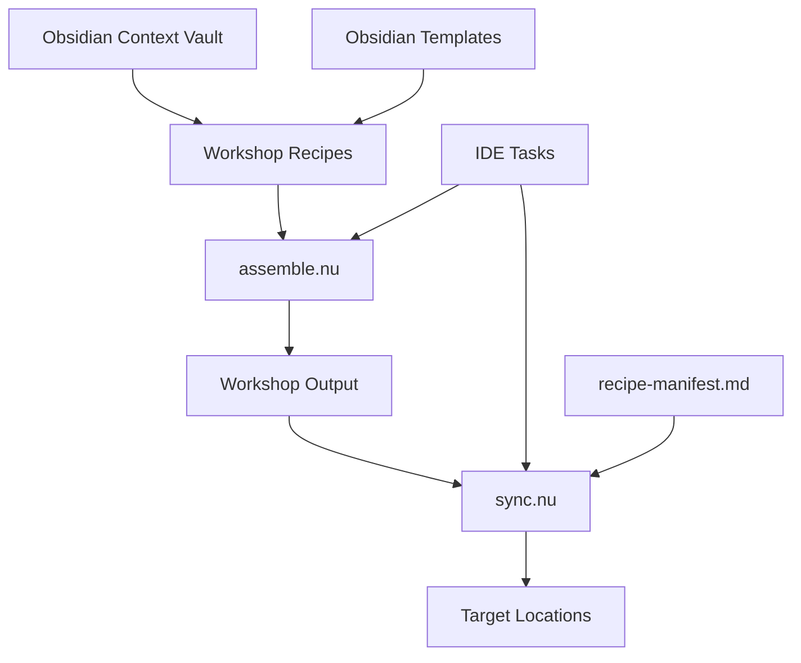

# 📋 Kiro Specs Documentation

*Complete 3-phase specification examples demonstrating structured development processes.*

## Table of Contents

- [Collectivist](#collectivist)
- [Context Workshop](#context-workshop)
  - [Design](#design---zdocumentscontextkirospecs-context-managementdesignmd)
  - [Requirements](#requirements---zdocumentscontextkirospecs-context-managementrequirementsmd)
  - [Tasks](#tasks---zdocumentscontextkirospecs-context-managementtasksmd)

---

## Collectivist
-  `C:\Users\synta.ZK-ZRRH\.dev\collectivist\.kiro\specs\collectivist`

### Spec

- design - `C:\Users\synta.ZK-ZRRH\.dev\collectivist\.kiro\specs\collectivist\design.md`
- reqs - `C:\Users\synta.ZK-ZRRH\.dev\collectivist\.kiro\specs\collectivist\requirements.md`
- tasks -  `C:\Users\synta.ZK-ZRRH\.dev\collectivist\.kiro\specs\collectivist\tasks.md`

---

## Context Workshop
- `Z:\Documents\.context\.kiro\specs\context-management`

### Spec

#### Design - `Z:\Documents\.context\.kiro\specs\context-management\design.md`

# Design Document

## Overview

A minimal context management system using two Nushell scripts for assembling and syncing context documentation. The system uses YAML recipes embedded in markdown to specify slice extraction and target deployment, following the bespoke principle of disposable software optimized for operator workflow.

## Architecture



**File locations:**
- **Scripts**: `C:/Users/synta.ZK-ZRRH/.dev/.scripts/assemble.nu` and `sync.nu`
- **Context vault**: `.context/` (Obsidian vault with templates and frontmatter)
- **Recipes**: `.context/workshop/` (created from Obsidian templates)
- **Output**: `.context/workshop/output/`
- **Manifest**: `.context/workshop/recipe-manifest.md` (Obsidian document)

## Components and Interfaces

### Recipe Format

**Obsidian frontmatter + YAML block:**
```markdown
---
id: recipe-claude-agent
created: 2026-01-11
modified: 2026-01-11
status: active
type:
  - "agent"
---

```yaml
name: claude-agent
target_locations:
  - path: ~/.config/claude/system.md
sources:
  - slice: agent=claudi-claude-code
    file: .context/agents/assistant.md
  - slice: skill=context-fundamentals  
    file: .context/skills/context-fundamentals/SKILL.md
template: |
  # Claude System Prompt
  {content}
```

# Claude Agent Recipe
This recipe assembles the Claude coding agent.
```

**Template structure** (from your existing templates):
- `recipe-agent-{{name}}.md`
- `recipe-kiro-{{name}}.md` 
- `recipe-power-{{name}}.md`
- `recipe-skill-{{name}}.md`

### Slice Extraction

**Existing slice markers:**
```markdown
<!-- slice:agent=claudi-claude-code -->
Content to extract
<!-- /slice -->
```

**Nushell slice extraction:**
```nu
def extract_slice [file: string, slice_id: string] {
  open $file 
  | lines 
  | where ($it | str contains $"<!-- slice:($slice_id) -->")
  | # Extract content between markers
}
```

### assemble.nu Script

**Location**: `C:/Users/synta.ZK-ZRRH/.dev/.scripts/assemble.nu`

**Core functionality (~50 lines):**
1. Find all recipe `.md` files in `.context/workshop/` (excluding templates/)
2. Parse Obsidian frontmatter and extract YAML code blocks
3. For each slice reference, extract content between slice markers
4. Apply simple string template substitution
5. Write assembled content to `.context/workshop/output/`
6. Update `.context/workshop/recipe-manifest.md` with run logs

**Key Nushell operations:**
- `ls .context/workshop/*.md | where name !~ templates` - Find recipes
- Parse frontmatter and extract YAML blocks from markdown
- `str replace` - Template substitution
- `save` - Write outputs
- Update manifest with Obsidian frontmatter

### sync.nu Script

**Location**: `C:/Users/synta.ZK-ZRRH/.dev/.scripts/sync.nu`

**Core functionality (~30 lines):**
1. Read existing recipe-manifest.md for deployment tracking
2. Copy all files from `.context/workshop/output/` to target locations
3. Track deployments in manifest
4. Remove files that were previously synced but no longer exist
5. Update recipe-manifest.md with sync results

**Key Nushell operations:**
- Parse manifest markdown for deployment records
- `cp` - Copy files to targets
- `rm` - Clean orphaned files
- Update manifest markdown with new deployment info

## Data Models

### Recipe Structure (Obsidian + YAML)
```markdown
---
id: recipe-name
created: 2026-01-11
modified: 2026-01-11
status: active | draft | archived
type:
  - "agent" | "kiro" | "power" | "skill"
---

```yaml
name: recipe-name
target_locations:
  - path: /target/location/file.md
sources:
  - slice: slice-identifier
    file: source/file/path.md
template: |
  Template with {content} substitution
```

# Recipe Description
Human-readable description of what this recipe does.
```

### Manifest Structure (Obsidian Markdown)
```markdown
---
id: recipe-manifest
created: 2026-01-11
modified: 2026-01-11
status: log
type:
  - "log"
---

## Active Recipes

- **recipe-claude-agent**: Last run 2026-01-11T10:30:00Z
  - Output: `claude-agent.md` → `~/.config/claude/system.md`
  - Status: ✓ synced

- **recipe-kiro-skills**: Last run 2026-01-11T10:30:00Z  
  - Output: `kiro-skills.md` → `~/.kiro/skills/bundle.md`
  - Status: ✓ synced

## Deployment Log

### 2026-01-11T10:30:00Z
- Assembled 3 recipes
- Synced 3 outputs
- Cleaned 1 orphaned file
```

## Correctness Properties

*Simple validation for a simple system - no enterprise theater.*

**Property 1: Recipe Processing Completeness**
*For any* valid recipe file in `.context/workshop/`, assemble.nu should process it and generate output
**Validates: Requirements 3.1**

**Property 2: Slice Extraction Accuracy**  
*For any* valid slice reference, the extracted content should match exactly what's between the slice markers
**Validates: Requirements 2.1**

**Property 3: Template Substitution**
*For any* recipe template with `{content}` placeholder, the output should have content substituted correctly
**Validates: Requirements 2.2**

**Property 4: Sync Completeness**
*For any* file in output folder, sync.nu should copy it to all specified target locations
**Validates: Requirements 3.2**

**Property 5: Orphan Cleanup**
*For any* file that was previously synced but no longer exists in output, sync.nu should remove it from targets
**Validates: Requirements 3.3**

## Error Handling

Simple error handling for disposable software:

- **File not found**: Skip and continue with clear message
- **Invalid YAML**: Report parsing error with line number
- **Missing slice**: Report missing slice reference
- **Permission errors**: Report and continue with other files
- **Target path creation**: Create directories as needed

## Testing Strategy

Minimal testing approach:

### Manual Testing
- Test with real recipes and slices
- Verify outputs match expectations
- Test sync cleanup behavior

### Simple Validation
- YAML parsing works
- Slice extraction works  
- File copying works
- Manifest tracking works

No complex property-based testing framework - just verify the basic operations work correctly.

#### Requirements - `Z:\Documents\.context\.kiro\specs\context-management\requirements.md`

# Requirements Document

## Introduction

A context management system for IDE integration that assembles sliced markdown content using YAML recipes and provides minimal tasks for execution. The system uses the existing organized context library structure and outputs assembled content to `.context/workshop/output/` with recipes in `.context/workshop/` for configuration.

## Glossary

- **Context_Library**: The `.context/` directory containing organized source documentation
- **Recipe**: YAML configuration embedded in markdown that specifies assembly instructions
- **Slice**: Marked sections in context files using metadata headers for granular extraction
- **Assembly_Task**: IDE task that processes a recipe to generate assembled output
- **Export_Task**: IDE task that copies assembled content from output folder to target locations
- **Workshop**: The `.context/workshop/` directory containing recipes and outputs
- **Output_Folder**: The `.context/workshop/output/` directory for assembled content

## Requirements

### Requirement 1: Recipe-Based Configuration

**User Story:** As a developer, I want YAML recipes embedded in markdown that specify how to assemble context content, so that I can configure different outputs for agents, skills, and powers.

#### Acceptance Criteria

1. WHEN creating recipes, THE Recipe_System SHALL support YAML embedded in markdown format
2. WHEN defining assembly instructions, THE Recipe SHALL specify source slices and target output locations
3. WHEN configuring for different systems, THE Recipe SHALL support agent, skill, power, and custom recipe types
4. WHEN recipes reference slices, THE Recipe SHALL use slice metadata headers for granular content extraction
5. THE Recipe_System SHALL store all recipes in the `.context/workshop/` directory

### Requirement 2: Slice-Based Content Assembly

**User Story:** As a developer, I want to assemble content from marked slices in context files, so that I can create granular, targeted outputs for different systems.

#### Acceptance Criteria

1. WHEN processing slices, THE Assembly_Engine SHALL extract content using slice metadata headers
2. WHEN assembling content, THE Assembly_Engine SHALL combine multiple slices according to recipe specifications
3. WHEN slices contain semantic JSON, THE Assembly_Engine SHALL embed JSON in markdown code blocks as needed
4. WHEN generating outputs, THE Assembly_Engine SHALL preserve slice ordering and formatting
5. THE Assembly_Engine SHALL output all assembled content to `.context/workshop/output/`

### Requirement 3: Minimal IDE Task Integration

**User Story:** As a developer, I want minimal IDE tasks for assembly and export operations, so that I can execute context management workflows efficiently.

#### Acceptance Criteria

1. WHEN executing the assembly task, THE Assembly_Task SHALL process all valid recipes in the workshop directory
2. WHEN executing the sync task, THE Sync_Task SHALL sync all valid content from the output folder to target locations
3. WHEN syncing content, THE Sync_Task SHALL delete files at target locations that were previously synced but are no longer in output
4. WHEN tasks execute, THE Task_System SHALL provide clear feedback on success or failure
5. THE Task_System SHALL follow the semantic JSON plugin command style for consistency

### Requirement 4: Output Logging and Versioning

**User Story:** As a developer, I want current version outputs logged to the workshop output folder, so that I can track and validate assembled content.

#### Acceptance Criteria

1. WHEN assembly completes, THE Output_Logger SHALL save assembled content to `.context/workshop/output/`
2. WHEN generating outputs, THE Output_Logger SHALL include version information and timestamps
3. WHEN content changes, THE Output_Logger SHALL maintain previous versions for comparison
4. WHEN validating outputs, THE Output_Logger SHALL provide copies for manual review
5. THE Output_Logger SHALL organize outputs by recipe type and target system

### Requirement 5: Agent Recipe Processing

**User Story:** As a developer, I want agent recipes that assemble persona and behavioral content, so that I can generate consistent agent definitions for different AI systems.

#### Acceptance Criteria

1. WHEN processing agent recipes, THE Agent_Processor SHALL extract role sigils and behavioral constraints from slices
2. WHEN assembling agent content, THE Agent_Processor SHALL combine persona elements according to recipe specifications
3. WHEN generating agent outputs, THE Agent_Processor SHALL create system prompts and configuration files
4. WHEN recipes specify multiple agents, THE Agent_Processor SHALL create separate outputs per agent
5. THE Agent_Processor SHALL support both Claude and Kiro agent formats

### Requirement 6: Skill Recipe Processing

**User Story:** As a developer, I want skill recipes that package capabilities for different AI systems, so that I can reuse skills across platforms.

#### Acceptance Criteria

1. WHEN processing skill recipes, THE Skill_Processor SHALL extract skill content from frontmatter and markdown
2. WHEN assembling skill bundles, THE Skill_Processor SHALL combine related skills according to recipe specifications
3. WHEN generating skill outputs, THE Skill_Processor SHALL create both individual and bundled formats
4. WHEN skills reference other content, THE Skill_Processor SHALL resolve and include referenced slices
5. THE Skill_Processor SHALL generate skill catalogs with searchable metadata

### Requirement 7: Power Recipe Processing

**User Story:** As a developer, I want power recipes that assemble Kiro power content, so that I can package powers for distribution and use.

#### Acceptance Criteria

1. WHEN processing power recipes, THE Power_Processor SHALL extract power documentation and configuration
2. WHEN assembling power content, THE Power_Processor SHALL combine POWER.md content with JSON configuration
3. WHEN generating power outputs, THE Power_Processor SHALL create complete power packages
4. WHEN powers have dependencies, THE Power_Processor SHALL include dependency information
5. THE Power_Processor SHALL validate power structure and completeness

### Requirement 8: Export and Synchronization

**User Story:** As a developer, I want a single sync task that manages all target locations, so that I can deploy all assembled content with one command.

#### Acceptance Criteria

1. WHEN executing the sync task, THE Sync_System SHALL process all valid content in the workshop output folder
2. WHEN syncing content, THE Sync_System SHALL copy content to all target locations specified in recipes
3. WHEN files exist at target locations but are no longer in output, THE Sync_System SHALL delete them
4. WHEN target locations don't exist, THE Sync_System SHALL create directory structures as needed
5. THE Sync_System SHALL maintain a sync manifest to track what was previously deployed for cleanup

### Requirement 9: Recipe Validation and Testing

**User Story:** As a developer, I want validation of recipes and assembled outputs, so that I can catch errors before deployment.

#### Acceptance Criteria

1. WHEN validating recipes, THE Validator SHALL check YAML syntax and required fields
2. WHEN checking slice references, THE Validator SHALL verify that all referenced slices exist
3. WHEN validating outputs, THE Validator SHALL compare assembled content against expected formats
4. WHEN running tests, THE Validator SHALL execute dry-run assembly operations
5. THE Validator SHALL provide clear error messages and suggestions for fixes

### Requirement 10: Workshop Organization and Management

**User Story:** As a developer, I want organized workshop structure for recipes and outputs, so that I can maintain clean separation between configuration and generated content.

#### Acceptance Criteria

1. WHEN organizing recipes, THE Workshop_Manager SHALL store all recipes in `.context/workshop/`
2. WHEN generating outputs, THE Workshop_Manager SHALL organize content in `.context/workshop/output/` by type
3. WHEN managing versions, THE Workshop_Manager SHALL maintain clean separation between current and historical outputs
4. WHEN cleaning up, THE Workshop_Manager SHALL provide tasks to remove stale outputs
5. THE Workshop_Manager SHALL maintain consistent directory structure and naming conventions

### Requirement 11: Absolute Path Configuration

**User Story:** As a developer, I want all scripts to use absolute paths for workspace directories, so that they work consistently regardless of execution context in the multi-workspace environment.

#### Acceptance Criteria

1. WHEN scripts initialize, THE Script_System SHALL use absolute paths for all workspace directories
2. WHEN resolving context library paths, THE Script_System SHALL use `Z:\Documents\.context` as the absolute base path
3. WHEN resolving script paths, THE Script_System SHALL use `C:\Users\synta.ZK-ZRRH\.dev\.scripts` as the absolute scripts directory
4. WHEN processing file references in recipes, THE Script_System SHALL resolve all paths relative to the absolute context base path
5. THE Script_System SHALL not rely on current working directory for path resolution

#### Tasks - `Z:\Documents\.context\.kiro\specs\context-management\tasks.md`

# Implementation Plan: Context Management

## Overview

Two Python scripts for assembling and syncing context documentation using Obsidian-based recipes with frontmatter and YAML blocks.

## Tasks

- [x] 1. Define recipe schemas for templates
  - Fill in the `{{agent recipe schema}}`, `{{kiro recipe schema}}`, `{{power recipe schema}}`, and `{{skill recipe schema}}` placeholders in existing templates
  - Define YAML structure for each recipe type based on their specific needs
  - Include required fields: name, target_locations, sources, template
  - Add type-specific fields as needed (e.g., agent format, skill bundle options)
  - _Requirements: 1.2, 1.3_

- [x] 2. Create assemble.py script
  - Create `C:/Users/synta.ZK-ZRRH/.dev/.scripts/assemble.py`
  - Parse Obsidian frontmatter and extract YAML code blocks from recipe files
  - Extract slices from source files using existing slice markers
  - Apply template substitution and generate outputs
  - Update recipe-manifest.md with run logs
  - _Requirements: 1.1, 2.1, 2.2, 3.1_

- [x] 3. Create sync.py script  
  - Create `C:/Users/synta.ZK-ZRRH/.dev/.scripts/sync.py`
  - Parse recipe-manifest.md for deployment tracking
  - Copy outputs to target locations specified in recipes
  - Clean up orphaned files that were previously synced
  - Update recipe-manifest.md with sync results
  - _Requirements: 3.2, 3.3, 8.2, 8.4, 8.5_

- [x] 4. Create IDE task configurations
  - Create task definitions for running assemble.py and sync.py
  - Configure tasks to run from workspace root with proper Python paths
  - Add task arguments for dry-run and verbose modes
  - _Requirements: 3.4_

- [ ] 5. Test with existing templates and manifest
  - Verify script works with existing Obsidian templates
  - Test slice extraction from real context files
  - Validate manifest updates work correctly
  - Test end-to-end assembly and sync workflow
  - _Requirements: 9.1, 9.2, 9.3_

## Notes

- Scripts will be ~50-100 lines each in Python
- Use `pyyaml` for YAML parsing and `frontmatter` for Obsidian frontmatter
- Focus on simple, readable code over complex error handling
- Leverage existing Obsidian template structure and slice markers

