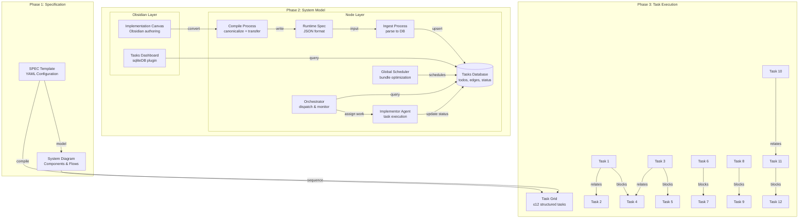
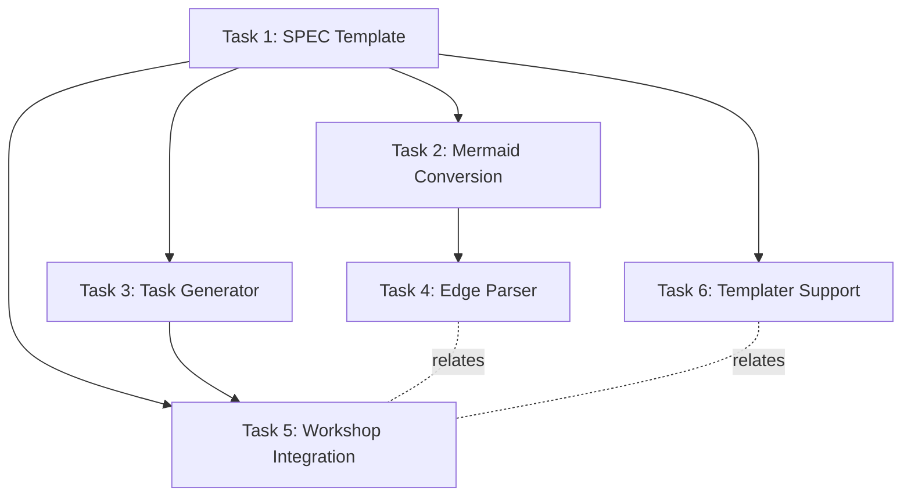

# Implementation Spec Example

*Template for structured implementation specifications using the 3-phase Kiro spec process.*

## Design Phase

### Overview

A template system for creating implementation specifications that follow the Kiro 3-phase process (Design → Requirements → Tasks) with visual modeling and structured task breakdown.

### Architecture



### Edge Semantics

| Edge Type | Purpose | Ordering | Usage |
|-----------|---------|----------|-------|
| **model** | SPEC → DIAGRAM refinement | Sequential | Design phase flow |
| **sequence** | DIAGRAM → TASKS derivation | Sequential | Implementation flow |
| **compile** | SPEC → TASKS shortcut | Direct | Skip diagram phase |
| **blocks** | Hard dependency/order | Strict | Task scheduling |
| **relates** | Soft association | None | Conceptual links |

## Requirements Phase

### Functional Requirements

#### FR1: SPEC Template System
- **Input**: Templater prompts for implementation details
- **Processing**: YAML structure with identity, goals, constraints, context
- **Output**: Structured specification document
- **Validation**: Valid YAML, unique impl_id, complete required fields

#### FR2: Visual System Modeling  
- **Input**: SPEC document and domain knowledge
- **Processing**: Component identification, boundary definition, flow mapping
- **Output**: Mermaid diagram with components, boundaries, and key flows
- **Validation**: All referenced nodes exist, edge semantics preserved

#### FR3: Task Compilation
- **Input**: SPEC and/or DIAGRAM artifacts
- **Processing**: Break down into ≤12 executable tasks
- **Output**: Structured task grid with dependencies
- **Validation**: All tasks have pointers, acceptance checks, valid dependencies

### Non-Functional Requirements

#### NFR1: Kiro Integration
- Follow 3-phase spec process (Design → Requirements → Tasks)
- Use templater syntax for dynamic content generation
- Maintain slice architecture for modular assembly
- Support workshop recipe compilation

#### NFR2: Edge Preservation
- Maintain original edge semantics (model, sequence, compile, blocks, relates)
- Preserve task dependency relationships
- Support both hard (blocks) and soft (relates) associations
- Enable visual representation through mermaid diagrams

#### NFR3: Template Consistency
- Align with existing Kiro template patterns
- Use consistent YAML structure across phases
- Support frontmatter metadata for workshop integration
- Enable automated assembly through slice markers

## Tasks Phase

### Task Structure Template

```yaml
# Standard task format aligned with Kiro patterns
title: {{task_title}}
order: {{sequence_number}}
status: draft
type: 
  - "implementation"
  - "{{task_category}}"
pointers:
  - {{repo_relative_path}}
acceptance_checks:
  - {{verifiable_end_state}}
depends_on: 
  - {{dependency_task_id}}
description: |
  {{optional_detail}}
# Kiro-specific extensions
slice_markers: true
workshop_integration: true
templater_support: true
```

### Implementation Tasks

#### Task 1: Create SPEC Template
- **Pointers**: `artifacts/templates/impl-spec-template.md`
- **Acceptance**: Template generates valid YAML with all required fields
- **Dependencies**: None
- **Type**: Foundation

#### Task 2: Design Mermaid Conversion
- **Pointers**: `scripts/canvas-to-mermaid.js`
- **Acceptance**: Canvas JSON converts to valid mermaid syntax
- **Dependencies**: [Task 1]
- **Type**: Conversion

#### Task 3: Implement Task Grid Generator
- **Pointers**: `scripts/task-grid-generator.js`
- **Acceptance**: Generates structured task markdown from spec
- **Dependencies**: [Task 1]
- **Type**: Generation

#### Task 4: Create Edge Semantic Parser
- **Pointers**: `scripts/edge-parser.js`
- **Acceptance**: Correctly identifies and preserves edge relationships
- **Dependencies**: [Task 2]
- **Type**: Processing

#### Task 5: Integrate Workshop Assembly
- **Pointers**: `workshop/templates/recipe-impl-spec-{{name}}.md`
- **Acceptance**: Spec components assemble via workshop recipes
- **Dependencies**: [Task 1, Task 3]
- **Type**: Integration

#### Task 6: Add Templater Support
- **Pointers**: `templates/impl-spec-prompts.md`
- **Acceptance**: Dynamic content generation through templater
- **Dependencies**: [Task 1]
- **Type**: Enhancement

### Dependency Graph



## Usage Instructions

### Phase 1: Specification
1. Use SPEC template with templater prompts
2. Fill in implementation identity, goals, constraints
3. Define domain context and acceptance criteria
4. Validate YAML structure and completeness

### Phase 2: System Modeling
1. Create mermaid diagram from SPEC requirements
2. Define component boundaries and relationships  
3. Map key flows (happy path + failure scenarios)
4. Preserve edge semantics for task derivation

### Phase 3: Task Execution
1. Compile SPEC/DIAGRAM into ≤12 structured tasks
2. Define dependencies using blocks/relates edges
3. Add pointers to actual repository paths
4. Include verifiable acceptance checks

### Integration Points

- **Workshop System**: Recipe-based assembly of spec components
- **Templater**: Dynamic content generation and prompts
- **Slice Architecture**: Modular composition via slice markers
- **Semantic JSON**: Canvas conversion to structured data
- **Kiro Specs**: 3-phase development process alignment

---

*This template preserves your edge structure while aligning with Kiro's 3-phase spec process and mermaid diagram approach.*